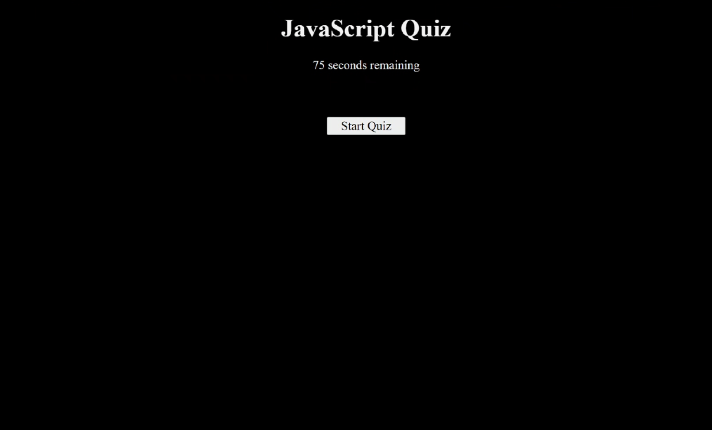

# Quiz-Challenge

## Table of Contents
 - [Description](#description)
 - [Usage](#usage)
 - [Credits](#credits)
 - [Contact](#contact)
 - [License](#license)

## Description
I wanted to build an interactive quiz menu that starts a timed quiz and stores the user's high scores. It will guage progress by assigning initials to each score, and has a countdown timer, buttons with CSS styling, and high score ranking. In addition, it also has confirmation popups that give you feedback on your choices as you go.

## Usage
Play the quiz, have fun, answer as fast as you can. If you answer incorrectly, a small amount of score will be deducted from your time, which at the end becomes your final score. The deployment can be found here: [Deployment](https://www.google.com)

## Credits
Michael Ikonomou, TA's Etc.

- GitHub Profile: [Cromananimation](https://github.com/Cromananimation)

- For additional questions, reach out to Cromananimation@gmail.com.

## Contact

Preferred method of communication: Github

## License

MIT License

    Permission is hereby granted, free of charge, to any person obtaining a copy of this software and associated documentation files (the "Software"), to deal in the Software without restriction, including without limitation the rights to use, copy, modify, merge, publish, distribute, sublicense, and/or sell copies of the Software, and to permit persons to whom the Software is furnished to do so, subject to the following conditions: The above copyright notice and this permission notice shall be included in all copies or substantial portions of the Software. THE SOFTWARE IS PROVIDED "AS IS", WITHOUT WARRANTY OF ANY KIND, EXPRESS OR IMPLIED, INCLUDING BUT NOT LIMITED TO THE WARRANTIES OF MERCHANTABILITY, FITNESS FOR A PARTICULAR PURPOSE AND NONINFRINGEMENT. IN NO EVENT SHALL THE AUTHORS OR COPYRIGHT HOLDERS BE LIABLE FOR ANY CLAIM, DAMAGES OR OTHER LIABILITY, WHETHER IN AN ACTION OF CONTRACT, TORT OR OTHERWISE, ARISING FROM, OUT OF OR IN CONNECTION WITH THE SOFTWARE OR THE USE OR OTHER DEALINGS IN THE SOFTWARE.